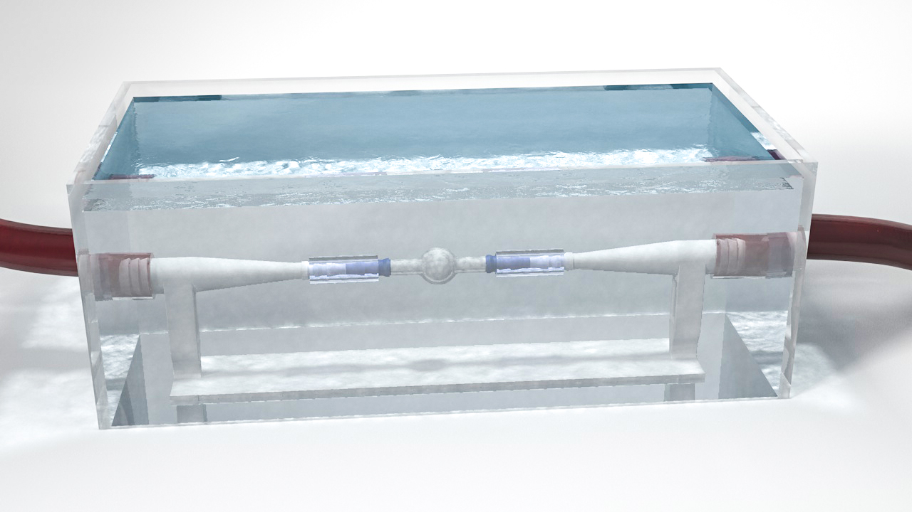

# CAPUT dataset

Dataset for the paper Analysis of the influence of imaging-related uncertainties on cerebral aneurysm deformation quantification using a no-deformation physical flow phantom.

Due to the large amount of data, the data was uploaded to an external server: Download link for CAPUT image dataset]()



```
Schetelig, D., Sedlacik, J., Fiehler, J., Frölich, A., Knopp, T., Sothmann, T., Werner, R. (2018).
Analysis of the influence of imaging-related uncertainties on cerebral aneurysm deformation quantification using a no-deformation physical flow phantom.
Scientific Reports, 8, 11004.
http://doi.org/10.1038/s41598-018-29282-0
```

## Folder / file structures

### Phantom structures

The main phantom structures are stored under "Deformative_Structures".

The inlet/oulet structures and the ground_plate are in the top folder.

```
├── Phantom
|     ├── ground_plate.stl
|     ├── inlet.stl
|     ├── Deformative_Structures
|     |    ├── 3 mm
|     |    |     ├── fusiformAneurysm.stl
|     |    |     ├── saccularAneurysm.stl
|     |    |     └── straightTube.stl
|     |    └── 4 mm
|     |          ├── fusiformAneurysm.stl
|     |          ├── saccularAneurysm.stl
|     |          └── straightTube.stl
```

### FPCT DATA

All original image data and the calculated edge information are saved as NIfTI (.nii) files.

[Link for the FPCT Data]()

```
├── data_description.md
|
├── 4mm_fusiformAneurysm
|   ├── Data
|   └── Edges
├── 4mm_saccularAneurysm
|   ├── Data
|   └── Edges
├── 4mm_straightTube
|   ├── Data
|   └── Edges
...
```


### VIDEO DATA

[Link for the video data]()
```
├── data_description.md
|
├── 4mm_fusiformAneurysm
|   ├── Data
|   └── edgepoints.txt
├── 4mm_saccularAneurysm
|   ├── Data
|   └── edgepoints.txt
├── 4mm_straightTube
|   ├── Data
|   └── edgepoints.txt
...
```

### Registration approach

Our chosen registration approach and parameters are detailed under [ants_registration_call.md](ants_registration_call.md).
